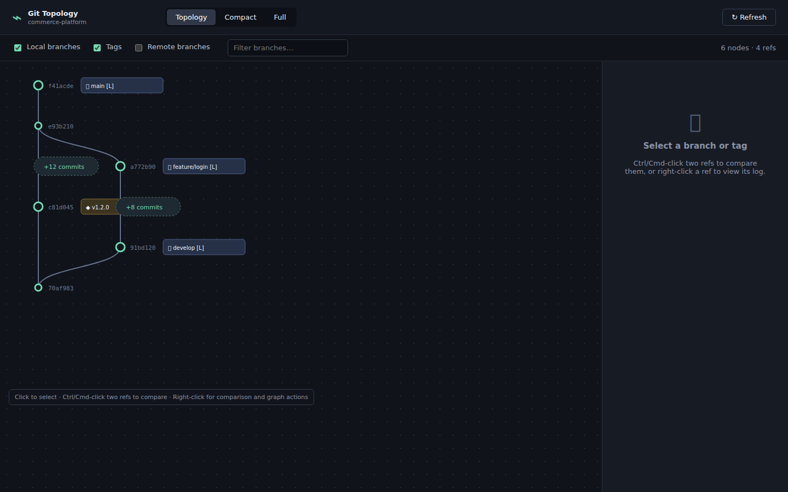
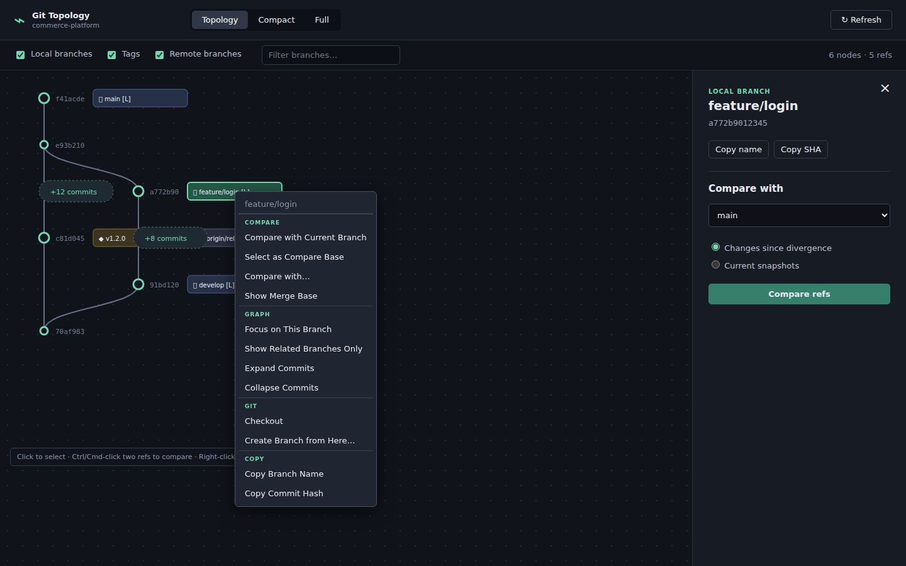

# Git Topology Viewer

[日本語版](README.ja.md)

A VS Code extension for understanding relationships between branches and tags from a repository's **commit DAG**. It never infers that one branch was created from another.

## Screenshots

Click an image to view it at full size.

[](docs/images/smoke-main-screen.png)

[](docs/images/smoke-branch-comparison-context-menu.png)

## Features

- A vertical **Branches & merges** graph of local branches and optional tags or remote branches.
- Each ref group has one edge to its nearest older visible ref in the Git DAG.
- The **Branches & merges** view groups ordinary linear commits into one summary node while preserving branch and merge points.
- Its options can hide ordinary commits entirely or show every commit instead of the summary nodes.
- No commit-range expansion controls.
- Select a ref to inspect its history; non-`main` branches start at their merge-base with the nearest graph target, while `main` shows its full history.
- Ctrl/Cmd-click two refs to compare their current snapshots automatically. Change the comparison target from the inspector dropdown; a loading indicator is shown while Git calculates the result.
- The comparison inspector shows the merge base and line statistics, with changed files shown by default. Use the **only left** and **only right** tabs to review commits unique to either ref.
- Select a history entry to inspect its changed files and line statistics.
- Read-only branch file diffs opened in VS Code's standard diff editor—no checkout required.
- Git CLI discovery from VS Code's Git extension, `gitTopology.gitPath`, then `PATH`.

## Open the viewer

Open a folder containing a Git repository, select the **Git Topology** graph icon in
the Activity Bar on the left, and choose **Open Git Topology Viewer**. You can also
run **Git Topology: Open Viewer** from the Command Palette.

## Run locally

```powershell
npm install
npm run build
```

Open this folder in VS Code, press **F5**, open a Git repository in the Extension
Development Host, then use the **Git Topology** icon in the Activity Bar.

### Webview smoke test

Install the pinned Chromium browser once, then render the production webview bundle,
exercise ref comparison, and save a screenshot:

```powershell
npm run smoke:install
npm run screenshots:refresh
```

The smoke screenshot is written to `artifacts/webview-smoke.png`, and the documentation
screenshots are refreshed in `docs/images/`. The same refresh can be run from the
manual **Refresh documentation images** GitHub Actions workflow. The complete
environment, automated assertions, manual review checklist, and troubleshooting notes
live in `.agents/skills/git-topology-webview-smoke-test/`.

## Design

The extension loads SHA/parent/ref summaries first through `git for-each-ref` and `git rev-list`. The immutable DAG is available as a commit-history view and is also projected into visible ref groups, with edges only where no other visible ref lies between them. Comparisons and file bodies are loaded only on demand through Git CLI commands.
