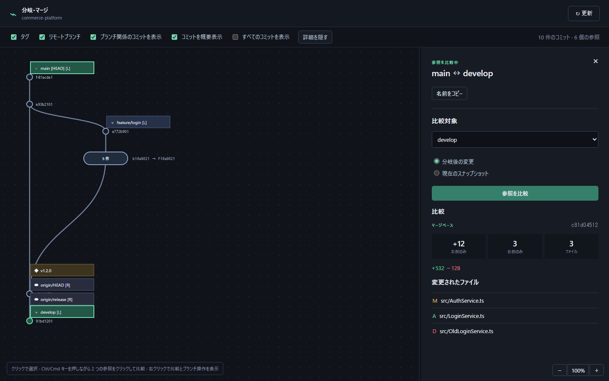
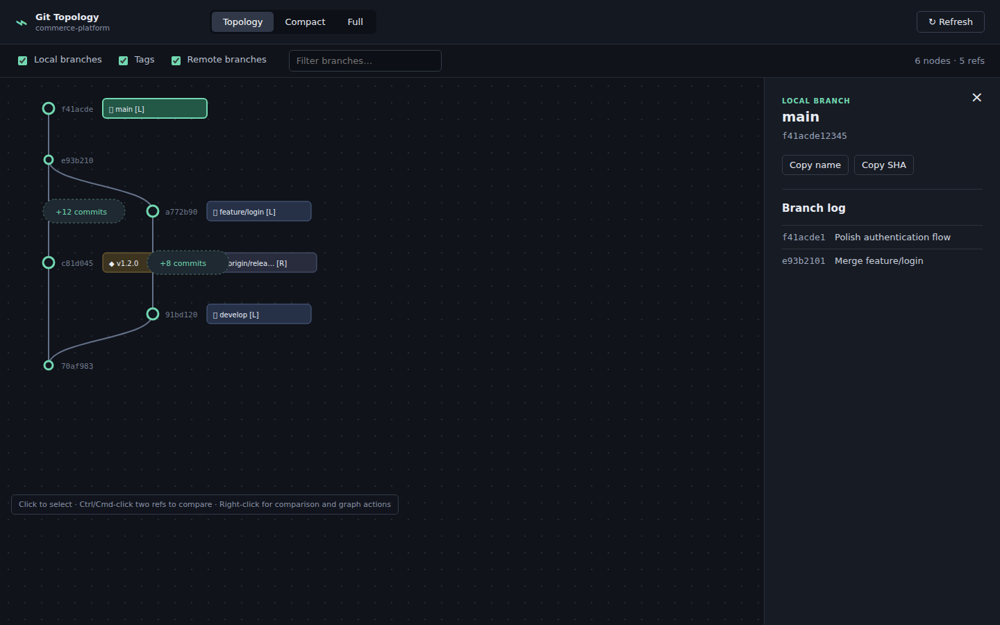

# Git Topology Viewer

[日本語版](README.ja.md)

A VS Code extension for reading a repository's **commit DAG** at the level you need. Branches and tags remain labels on commits; the viewer never invents a branch-parent tree.

## Features

- **Topology**, **Compact**, and **Full** vertical graph modes.
- Collapsed linear commit ranges that expand independently.
- Local branches and tags, with optional remote branches and a branch filter.
- Ref comparison with merge base, unique commits, line statistics, and changed files.
- Click a branch, tag, or remote ref to inspect its commit history; expand a commit to see file-level additions and deletions.
- Read-only branch and commit file diffs opened in VS Code's standard diff editor—no checkout required.
- Git CLI discovery from VS Code's Git extension, `gitTopology.gitPath`, then `PATH`.

## Open the viewer

Open a folder containing a Git repository, select the **Git Topology** graph icon in
the Activity Bar on the left, and choose **Open Git Topology Viewer**. You can also
run **Git Topology: Open Viewer** from the Command Palette.

## Run locally

```powershell
npm install
npm run build
```

Open this folder in VS Code, press **F5**, open a Git repository in the Extension
Development Host, then use the **Git Topology** icon in the Activity Bar.

### Webview smoke test

Install the pinned Chromium browser once, then render the production webview bundle,
exercise ref comparison, and save a screenshot:

```powershell
npm run smoke:install
npm run smoke:webview
```

The screenshot is written to `artifacts/webview-smoke.png`. The complete environment,
automated assertions, manual review checklist, and troubleshooting notes live in
`.agents/skills/git-topology-webview-smoke-test/`.

## Sample





## Design

The extension loads SHA/parent/ref summaries first through `git for-each-ref` and `git rev-list`. The immutable DAG is converted into a mode-specific view graph and then laid out. Comparisons and file bodies are loaded only on demand through Git CLI commands.
